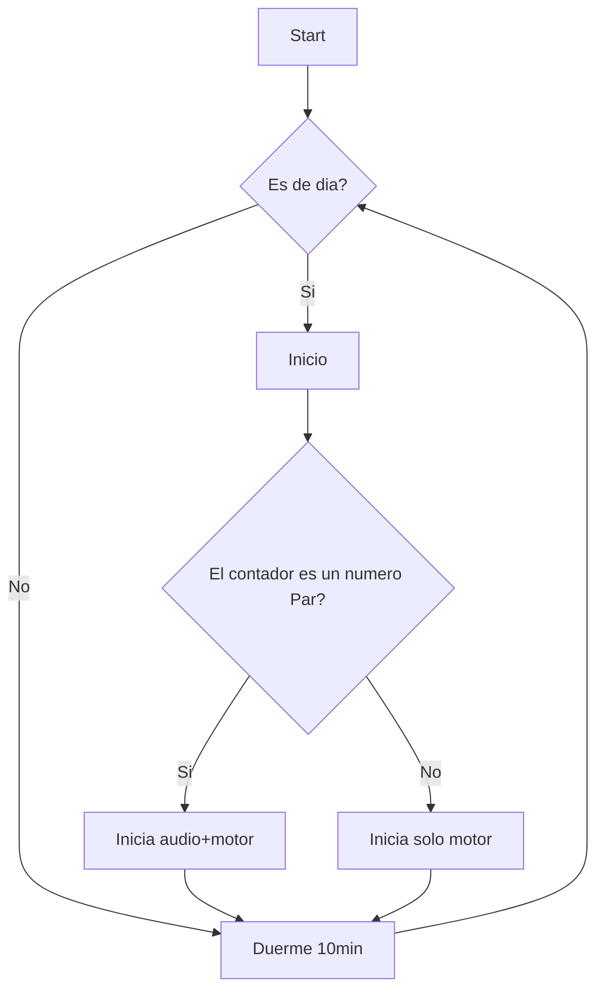

# Espantapájaros Solar

Hola!  con mi eterna pelea con los pájaros de forma not-letal (mi coche muchas veces vive en la calle) para desanimar a usar nuestra huerta de buffet-free

*Read this in other languages: [English](README.en.md)

# Hardware

no es la mejor selección de los materiales pero la presión de mi madre en que haga "algo" , las prisas no son buenas consejeras

## Suministro electrico

Uso un stepup para alimentar el esp32 y los motores con 6v
el stepup sube el voltaje 4.2v de las baterias a 6v , con el esp32 en modo sleep (ahoro) el consumo es considerable 18ma (*24h)

Las 2 placas solares en paralelo bajo el sol me da unos 120ma/h 
Cargo las baterias con un tp4056 , necesitas baterías con protección de bajo voltaje , los bms habría sido mejor una mejor elección

Mido la corriente de las placas solares con una divisor de tension (7.2v -> 3.3v)

# Arduino

- Hay que subir el directorio /Data al Spiff del esp32, contiene los *.mp3, se puede poner lo que quieras hasta 1.5mb (reggaton???)
https://github.com/me-no-dev/arduino-esp32fs-plugin

- Hay que instalar esta librería para el max


## Funcionamiento


## Variables

```c++
// config
// cuando acabe lo mandamos al modo sleep (ahoro de bateria) 10min 
const int timeSleep = 60 * 10  * uS_TO_S_FACTOR;
// el tiempo que funciona audio y el motor (10seg) 
const int timeRunning = 10 * 1000; 
// el volumen de el audio (maximo 3.99)
const float volume = 1.5;
//si el voltage es menor lo mandamos al sleep (se supone que es de noche)
const float minVoltage = 0.5; 
int _speed = 255; // velocidad del motor (0-255)

```
### 


## Lista de la compra

> **Nota:** no tengo nada que ver con el vendedor, son los enlaces de mi compra.

1 x DC 6V N20 Mini Micro Metal Gear Motor with Gearwheel DC Motors 30 RPM
https://www.aliexpress.com/item/33022320164.html

1 x Dual Motor Driver 1A TB6612FNG
https://www.aliexpress.com/item/32223093678.html

3 x 3PIN and 1 x 2Pin PCB Screw Terminals Blocks Connector 2.54MM Pitch 
https://www.aliexpress.com/item/1005001711075410.html

2 x Mini 6V 1W Solar Panel 
https://www.aliexpress.com/item/32817603341.html

1 x Single Cell Micro USB Power Supply Board TP4056
https://www.aliexpress.com/item/32964995078.html

1 x MT3608 DC-DC Step Up Power
https://www.aliexpress.com/item/32671989238.html

1 x speaker waterproof 8 ohm 3W Diameter 57MM
https://www.aliexpress.com/item/1005002657272394.html

1 x 18650 Battery box double holder
https://www.aliexpress.com/item/4000098297232.html

1 x Max98357 I2S 3W Class D Amplifier
https://www.aliexpress.com/item/4000086613283.html

1 x Esp32 DEVKIT V1
https://a.aliexpress.com/_vYtC43

2x Battery 18650 with protection

### Other

- 2x 606ZZ 6x17x6mm (gears)
https://www.aliexpress.com/item/1005001826957482.html

2 x 608ZZ 8x22x7mm (rudder)
https://www.aliexpress.com/item/4001058241232.html

wooden Self-tapping screw M2x8mm and M2x6mm
https://www.aliexpress.com/item/1005002336941795.html

18 x Screw M3 x 12mm
https://www.banggood.com/M3-Bolts-Stainless-Steel-Screws-Button-Head-Socket-Cap-10-Size-p-952124.html

### Tools
#### drill bit :

- 3mm(better 3.1) 
- 2.8mm (thread) 
- 2mm
- 1.6mm (thread)
